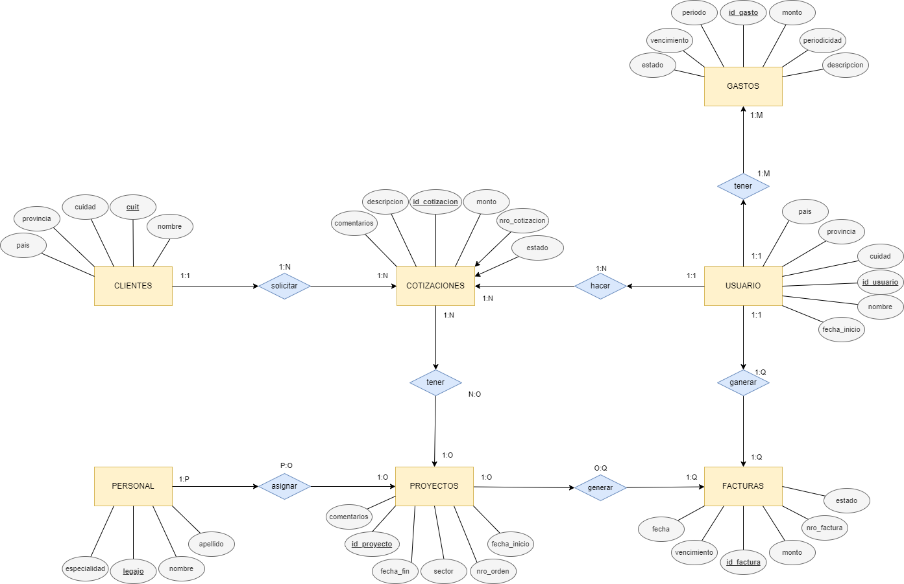
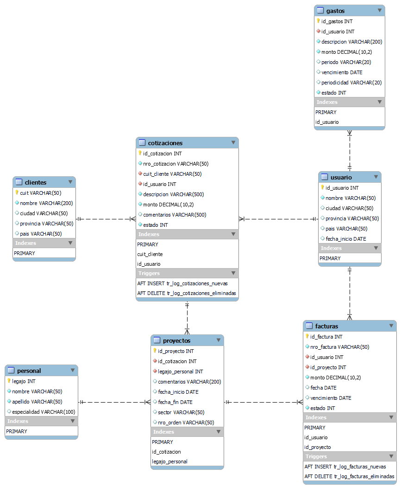
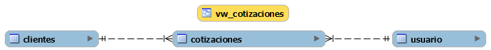
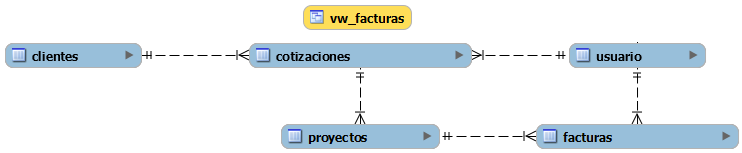
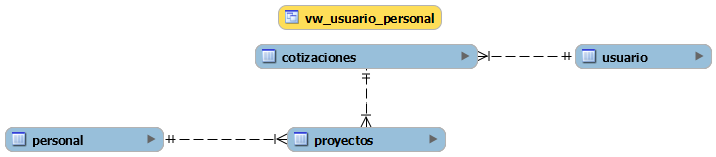
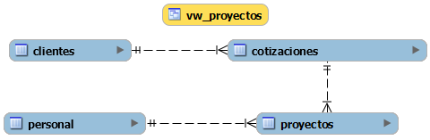
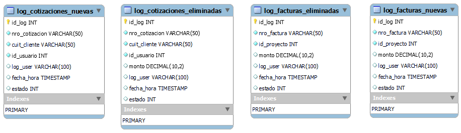
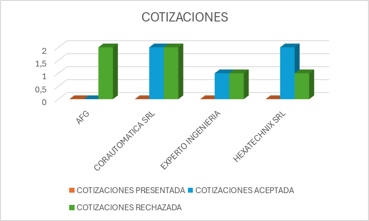
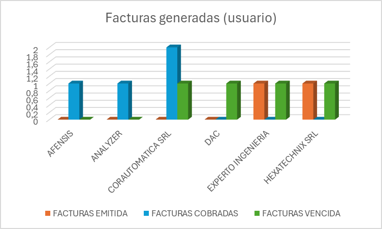
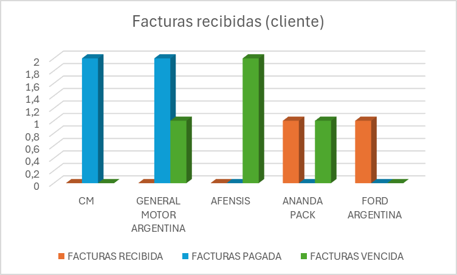

# Gestion de trabajo - Base de datos

> ***Creador: Diego Gabriel Paolantonio***

---
## Introducción
En este documento se explicará el diseño e implementación de una base de datos en *"MySQL Workbench 8.0"*, para la aplicación ***"Gestión de trabajo"***, que todavía se encuentra en desarrollo, la cual está pensada para mejorar la performance de un negocio freelance o Pyme, mediante una mejor organización de la información laboral, y la obtención de datos para el análisis y una mejor toma de decisiones

---

## Negocio
El modelo de negocios se basa en personas que trabajan freelance o Pymes, los cuales necesitan organizar los datos de Usuario, Personal, Clientes, Cotizaciones, Proyectos, Facturas y Gastos

---

## Situación
Sin una base de datos para la organización de la información, se genera una gran dificultad de gestionar los gastos y facturas, y realizar el seguimiento de los trabajos.
Además, una base de datos nos permitiría realizar el análisis del éxito de proyectos realizados, si los costos fueron acordes a lo cotizado, si la cantidad de personal es la óptima para el volumen de trabajo, la efectividad de pago de cada cliente, y poder predecir en el año los meses más solicitados.

---

## Objetivo
La organización es primordial para lograr una buena gestión, en esta aplicación se podrán cargar los datos del usuario, personal, clientes, proyectos, facturas y gastos. De esta manera se puede tener un control de los trabajos, poder gestionar el personal, y poder llevar un control de los pagos.

---

## Diagramas Entidad-Relacion

---

## Tablas
### Descripción:

-	Usuario: Contiene información del usuario.

| KEY | COLUMN | TYPE | LENGHT | NOT NULL | DEFAULT | NOTES |
|----|----|----|----|----|----|----|
| PK | id_usuario | INT | | X | AUTO_INCREMENT | ID DEL USUARIO |
| | nombre | VARCHAR | 50 | X | | NOMBRE DE USUARIO O EMPRESA |
| | cuidad | VARCHAR | 50 | | | CUIDAD DONDE ESTA UBICADO |
| | provincia | VARCHAR | 50 | | | PROVINCIA DONDE ESTA UBICADO |
| | pais | VARCHAR | 50 | | | PAIS DONDE ESTA UBICADO |
| | fecha_inicio | DATE | | | | FECHA DE INICIO DE ACTIVIDAD |

-	Gastos: Contiene los gastos laborales del usuario.

| KEY | COLUMN | TYPE | LENGHT | NOT NULL | DEFAULT | NOTES |
|----|----|----|----|----|----|----|
| PK | id_gastos | INT | | X | AUTO_INCREMENT | ID DEL GASTO O COBRO AL USUARIO |
| FK | id_usuario | INT | | X | | ID DEL USUARIO |
| | descripcion | VARCHAR | 200 | X | | DESCRIPCION DEL GASTO |
| | monto | DECIMAL | 10,2 | X | | MONTO DEL GASTO |
| | periodo | VARCHAR | 20 | | | PEDIODO AL QUE PERTENECE EL GASTO |
| | vencimiento | DATE | | | | VENCIMIENTO DEL PAGO |
| | periodicidad | VARCHAR | 20 | | | REPETITIVIDAD DEL PAGO |
| | estado | INT | | | | ESTADO DEL GASTO, NO PAGADO (0) y PAGADO (1) |

-	Clientes: Contiene los datos principales de los clientes.

| KEY | COLUMN | TYPE | LENGHT | NOT NULL | DEFAULT | NOTES |
|----|----|----|----|----|----|----|
| PK | cuit | VARCHAR | 50 | X | | CUIT DEL CLIENTE |
| | nombre | VARCHAR | 200 | X | | NOMBRE DEL CLIENTE |
| | ciudad | VARCHAR | 50 | | | CUIDAD DEL CLIENTE |
| | provincia | VARCHAR | 50 | | | PROVINCIA DEL CLIENTE |
| | pais | VARCHAR | 50 | | | PAIS DEL CLIENTE |

-	Cotizaciones: Contiene los datos de las cotizaciones realizadas.

| KEY | COLUMN | TYPE | LENGHT | NOT NULL | DEFAULT | NOTES |
|----|----|----|----|----|----|----|
| PK | id_cotizacion | INT | | X | AUTO_INCREMENT | ID DE LA COTIZACION |
| FK | cuit_cliente | VARCHAR | 50 | X | | CUIT DEL CLIENTE |
| FK | id_usuario | INT | | X | | ID DEL USUARIO |
| | nro_cotizacion | VARCHAR | 50 | X | | NUMERO DE LA COTIZACION |
| | descripcion | VARCHAR | 500 | X | | DESCRIPCION DE LA COTIZACION |
| | monto | DECIMAL | 10,2 | X | | MONTO TOTAL DE LA COTIZACION |
| | comentarios | VARCHAR | 500 | | | COMENTARIOS DE INFORMACION EXTRA |
| | estado | INT | | | | ESTADO DE LA COTIZACION QUE PUEDE ESTAR PRESENTADA (0), ACEPTADA (1) O RECHAZADA (2) |

-	Personal: Contiene los datos del personal contratado por el usuario o empresa.

| KEY | COLUMN | TYPE | LENGHT | NOT NULL | DEFAULT | NOTES |
|----|----|----|----|----|----|----|
| PK | legajo | INT | | X | AUTO_INCREMENT | LEGAJO ASIGNADO AL EMPLEADO |
| | nombre | VARCHAR | 50 | X | | NOMBRE DEL EMPLEADO |
| | apellido | VARCHAR | 50 | X | | APELLIDO DEL EMPLEADO |
| | especialidad | VARCHAR | 100 | | | ESPECIALIDAD DE TRABAJO |

-	Proyectos: Proyectos que se realizaron

| KEY | COLUMN | TYPE | LENGHT | NOT NULL | DEFAULT | NOTES |
|----|----|----|----|----|----|----|
| PK | id_proyecto | INT | | X | AUTO_INCREMENT | ID DEL PROYECTO |
| FK | id_cotizacion | INT | | X | | NUMERO DE COTIZACION ASOCIADO A PROYECTO |
| FK | legajo_personal | INT | | X | | LEGAJO ASIGNADO AL EMPLEADO |
| | comentarios | VARCHAR | 200 | | | COMENTARIOS DEL TRABAJO |
| | fecha_inicio | DATE | | | | FECHA DE INICIO DEL PROYECTO |
| | fecha_fin | DATE | | | | FECHA DE FIN DEL PROYECTO |
| | sector | VARCHAR | 50 | | | SECTOR EN EL QUE SE REALIZA |
| | nro_orden | VARCHAR | 50 | | | NUMERO DE ORDEN EMITIDO POR EL CLIENTE |

-	Facturas: Facturas emitidas por los proyectos realizados

| KEY | COLUMN | TYPE | LENGHT | NOT NULL | DEFAULT | NOTES |
|----|----|----|----|----|----|----|
| PK | id_factura | INT | | X | AUTO_INCREMENT | ID DE FACTURA EMITIDA POR EL USUARIO |
| FK | id_usuario | INT | | X | | ID DEL USUARIO |
| FK | id_proyecto | INT | | X | | ID DEL PROYECTO |
| | nro_factura | VARCHAR | 50 | X | | NUMERO DE FACTURA EMITIDA POR EL USUARIO |
| | monto | DECIMAL | 10,2 | X | | MONTO FACTURADO |
| | vencimiento | DATE | | | | FECHA DE VENCIMIENTO DE LA FACTURA |
| | fecha | DATE | | | | FECHA DE EMICION DE LA FACTURA |
| | estado | INT | | | | ESTADO DE LA FACTURA EMITIDA (0), PAGADA (1) y VENCIDA (2) |

### Modelo esquematico

---

## Funcionalidad
### Vistas:
#### Descripcion:
| VIEW | TABLAS QUE COMPONE | DESCRIPCION |
|----|----|----|
| vw_cotizaciones | Cotizaciones, Clientes, Usuario | Visualiza las cotizaciones que hizo cada usuario a los clientes. |
| vw_facturas | Facturas, Usuario, Proyectos, Cotizaciones, Clientes | Visualiza las facturas emitidas por los usuarios a los clientes con los datos de los proyectos. |
| vw_usuario_personal | Proyectos, Personal, Cotizaciones, Usuario | Visualiza que personal lo realizo un proyecto para cada usuario y entre que fechas. |
| vw_proyectos | Proyectos, Personal, Cotizaciones, Clientes | Visualiza los proyectos de cada cliente y que personal lo realizo. |

#### Modelo esquematico:

### Funciones:
| FUNCTION | INPUT | OUTPUT | DESCRIPCION |
|----|----|----|----|
| campo_existe | campo [VARCHAR(200)] | existe [INT] => 0: campo no existe. 1: campo existe. | Llamado en los Stored Procedure: crear_usuario, eliminar_cliente_cuit, ordenar_clientes |
| facturas_usuario_cliente | usuario [INT]: id del usuario. cliente [VARCHAR (50)]: cuit_cliente de los proyectos realizado. anio [INT]: año del vencimiento de la factura. | total [FLOAT] => suma total de lo facturado por un usuario a un cliente en el año especifico. | |
| total_mensual_facturado | usuario [INT]: id del usuario. anio [INT]: año del vencimiento de la factura. mes [INT]: mes del vencimiento de la factura. | total [FLOAT] => suma total de lo facturado por un usuario en el año y mes especifico. | |	 

### Stored Procedure:
| STORED PROCEDURE | TABLAS | INPUT | DESCRIPCION |
|----|----|----|----|
| crear_cliente | clientes | var_cuit: CUIT del cliente. var_nombre: nombre del cliente. var_ciudad: cuidad del cliente. var_provincia: provincia del cliente. var_pais: país del cliente. | Crea un usuario con los datos enviados. |
| eliminar_cliente_cuit | clientes | var_cuit: CUIT del cliente. | Elimina el cliente con el “cuit” especificado. |
| ordenar_cliente | clientes | campo: nombre de la columna. tipo_orden: "asc" o "desc". | Ordena la tabla cliente con por el campo especificado y de manera ascendente o descendente según se envíe ASC o DESC. |

### Triggers:

#### Descripcion:

| TRIGGER | TABLA MONITOREADA | ACCION | TABLA DE REGISTRO | DATOS REGISTRADOS | DESCRIPCION |
|----|----|----|----|----|----|
| tr_log_cotizaciones_nuevas | cotizaciones | AFTER INSERT | log_cotizaciones_nuevas | nro_cotizacion, cuit_cliente, id_usuario, log_user, fecha_hora, estado | Crea un log por cada cotización creada. |
| tr_log_cotizaciones_eliminadas | cotizaciones | AFTER DELETE | log_cotizaciones_eliminadas | nro_cotizacion, cuit_cliente, id_usuario, monto, log_user, fecha_hora, estado | Crea un log por cada cotización eliminada. |
| tr_log_facturas_nuevas | facturas | AFTER INSERT | log_facturas_nuevas | nro_factura, id_proyecto, monto, log_user, fecha_hora, estado | Crea un log por cada factura creada. |
| tr_log_facturas_eliminadas | facturas | AFTER DELETE | log_facturas_eliminadas | nro_factura, id_proyecto, monto, log_user, fecha_hora, estado | Crea un log por cada factura eliminada. |

#### Modelo esquematico:

---

## Informes generados
### Cotizaciones realizadas:
Con este grafico intentamos dejar de manera visual el éxito en ganar las cotizaciones presentadas por los usuarios y de esta manera poder ir viendo de mejorar la aceptación y obtener más proyectos.

### Facturas emitidas, cobradas o vencidas por usuario:
Aquí se analizan el estado de las facturas que fueron emitidas por los usuarios en los proyectos realizados para poder analizar cómo están las cobranzas y poder mejorar los métodos de comunicación con los clientes:

### Facturas recibidas, pagadas y vencidas a por los clientes:
Aquí analizamos cuales clientes son los mas cumplidores respecto de los pagos:

---

## Herramientas utilizadas
- MySQL Workbench
- Microsoft Excel
- Microsoft Word
- https://app.diagrams.net/

---

## Enlace al archivo .pdf

[informe_en_pdf](./Gestión%20trabajo.pdf)

---